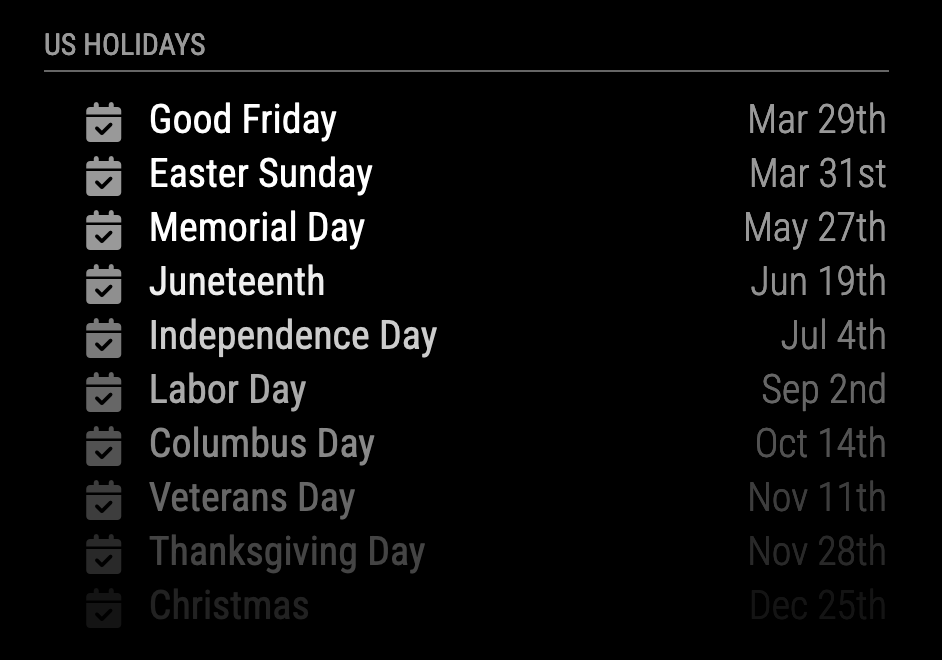

# Module: MMM-GoogleCalendar

This module is a customization from MagicMirror's default calendar module to display your Google calendars (including the Google Family calendar) without needing to make calendars public or using iCals. Inspired by the [GoogleTask module](https://github.com/jgauth/MMM-GoogleTasks).

## Screenshot


## How to Setup

This guide will walk you through installing and configuring the MMM-GoogleCalendar module.

### Prerequisites
- MagicMirror² installed.
- **Node.js:** This module requires Node.js version `22.14.0` or higher. Please ensure your MagicMirror installation is running on a compatible Node.js version. You can check this via the `.nvmrc` file in the module directory and use a Node version manager like `nvm` to switch if needed (e.g., `nvm use`).

### Installation Steps

1. **Open Your Command Line Tool:**
   Access your terminal or command prompt.

2. **Navigate to MagicMirror's Modules Folder:**
   Change to the directory where your MagicMirror modules are stored. Typically, this is:
   `cd ~/MagicMirror/modules`

3. **Clone the Module Repository:**
   Download the MMM-GoogleCalendar module:
   `git clone https://github.com/randomBrainstormer/MMM-GoogleCalendar.git`

4. **Install Dependencies:**
   - Navigate into the newly cloned module's directory:
     `cd MMM-GoogleCalendar`
   - Install the necessary Node.js dependencies. This module uses updated libraries like `googleapis` for better performance and security.
     `npm install`

With the module downloaded and dependencies installed, the next step is to configure Google Cloud access.

### Setting Up Google Cloud Project and Credentials

To allow this module to access your Google Calendar, you need to set up a project in Google Cloud Platform and get API credentials.

1.  **Create or Select a Google Cloud Project:**
    *   Go to the [Google Cloud Console](https://console.cloud.google.com/).
    *   Create a new project or select an existing one. For detailed instructions, see [Creating a project](https://developers.google.com/workspace/guides/create-project).

2.  **Enable the Google Calendar API:**
    *   In your Google Cloud Project, ensure the Google Calendar API is enabled.
    *   Follow the instructions at [Enable the Google Calendar API](https://developers.google.com/calendar/api/quickstart/nodejs#set_up_your_environment) (you only need to do the "Enable the API" part).

3.  **Configure the OAuth Consent Screen:**
    *   This is crucial for allowing the module to ask for permission to access your calendar.
    *   Follow the guide at [Configure the OAuth consent screen](https://developers.google.com/calendar/api/quickstart/nodejs#configure_the_oauth_consent_screen).
    *   **Important:** While your app is in "Testing" mode during setup, add your Google account email address to the "Test users" list. If you don't, you'll encounter errors during the authorization step.

4.  **Create OAuth 2.0 Client ID Credentials:**
    *   In the Google Cloud Console, navigate to "APIs & Services" > "Credentials".
    *   Click "+ CREATE CREDENTIALS" and select "OAuth client ID".
    *   **Application type: Select "Desktop application".** This is the only type supported by this module. Using other types will result in authentication errors.
    *   Give it a name (e.g., "MMM-GoogleCalendar Client").
    *   Click "CREATE".
    *   A dialog will show your client ID and client secret. Click "DOWNLOAD JSON" to download the credentials file. This file will likely be named something like `client_secret_[...].json`.
    *   **Rename the downloaded file to `credentials.json`.** This file must contain an `installed` key which in turn contains `client_id`, `client_secret`, `redirect_uris`, etc.

5.  **Place `credentials.json` in the Module Folder:**
    *   Move the renamed `credentials.json` file into the `MMM-GoogleCalendar` module directory (e.g., `~/MagicMirror/modules/MMM-GoogleCalendar/credentials.json`).

### Authorizing the Module

1.  **Run the Authorization Script:**
    *   In your terminal, ensure you are in the `MMM-GoogleCalendar` directory:
        `cd ~/MagicMirror/modules/MMM-GoogleCalendar`
    *   Execute the authorization script:
        `node authorize.js`
    *   The script will output a URL. Copy this URL.

2.  **Authorize in Your Browser:**
    *   Paste the copied URL into a web browser on any device (your computer, phone, etc.).
    *   Sign in with the Google account whose calendar you want to display.
    *   You may encounter a "Google hasn’t verified this app" warning. This is expected if your OAuth consent screen is still in "Testing" mode and you haven't published it. Click "Advanced" (or similar) and then choose to "Go to [Your Project Name] (unsafe)" or "Continue".
    *   Grant the requested permissions for Google Calendar access.

3.  **Provide Authorization Code to Script:**
    *   After granting permissions, your browser will be redirected to a page (it might appear as a "This site can’t be reached" error, a blank page, or show a "Success" message depending on your setup – this is normal).
    *   **Copy the entire URL from your browser's address bar.** This URL contains the authorization code needed by the script (it will be in the `code` query parameter).
    *   Paste this full URL back into the terminal where `authorize.js` is waiting and press Enter.

4.  **Token Generation:**
    *   If successful, the script will exchange the code for tokens, and a `token.json` file will be created in the `MMM-GoogleCalendar` directory. This file stores the authorization, allowing the module to access your calendar.

You have now successfully configured the module to access your Google Calendar. The next step is to add it to your MagicMirror `config.js`.

*A note for contributors: The codebase has been modernized to ES6+ standards, includes ESLint for code quality, and has initial unit tests with Jest.*

## Using the module

### Configuration

Now it's time to bring your calendar to life on your MagicMirror! To do this, you need to add a specific configuration block to your MagicMirror's settings. This block of code tells your MagicMirror how to display your Google Calendar and which calendar to show.

Here's how you set it up:

1. Open the `config/config.js` file in your MagicMirror directory. Remember, you should now be in the main directory of MagicMirror², not in the MMM-GoogleCalendar module directory. If you're not sure you're in the right place, the path should look something like this: `~/MagicMirror/config/config.js`.
2. **Add Module Configuration:**
   - Now, integrate the module into your MagicMirror² by adding the following configuration block to the `modules` array in the `config/config.js` file. It's crucial to replace `"MyGoogleCalendarIDHere"` with your actual calendar ID.

     ```javascript
     {
         module: 'MMM-GoogleCalendar',
         header: "My Google Private Cal",
         position: "top_left",
         config: {
             calendars: [
                 {
                   symbol: "calendar-week",
                   calendarID: "MyGoogleCalendarIDHere"
                 },
                 // To add more calendars, replicate the above entry within this array with the respective ID
             ],
         }
     },
     ```

     **Finding Your Google Calendar ID:**
     If you're unsure where to find your Google Calendar ID, it's quite straightforward:
     - Head over to your Google Calendar by visiting [https://calendar.google.com](https://calendar.google.com).
     - Look for the settings icon (resembling a gear) in the upper right corner and click on it to access `Settings`.
     - On the left side, navigate to `Settings for my calendars`, and select the calendar you wish to display on MMM-GoogleCalendar.
     - Scroll until you find the `Integrate calendar` section. Your calendar ID is listed there. This ID usually ends with `@group.calendar.google.com`.
     - There's no need to modify any settings here—just copy the Calendar ID and replace `"MyGoogleCalendarIDHere"` in the module configuration with your actual ID.

### Configuration Options

This module is designed specifically for Google calendars, but it inherits many customizable features from the original MagicMirror² calendar module. To explore all the available options and tailor your calendar display to your liking, please refer to the [MagicMirror² documentation](https://docs.magicmirror.builders/modules/calendar.html).

We are committed to improving and updating this module, so if you have enhancements or updates, feel free to contribute. Merge requests with the latest changes are always appreciated and welcome!

## Internationalization (i18n)

We welcome translations! If you'd like to translate the module into your language:
1. Copy the `translations/en.json` file.
2. Rename it to your language code (e.g., `de.json` for German).
3. Translate the string values in your new file.
4. Add your new translation file to the `getTranslations` function in `MMM-GoogleCalendar.js`.
5. Submit your changes as a pull request or issue on GitHub. Thank you for your contribution!

## FAQ

**What happened to the old types of OAuth credentials?**
Previously, this module might have worked with or documentation might have confusingly referenced `Web Application` or `TV & Limited Input devices` OAuth credential types. **This module now exclusively supports the `Desktop app` credential type.** This change simplifies the setup process significantly with the current Google authentication libraries. Ensure you download the `credentials.json` for a "Desktop application" from Google Cloud Console.

**Can this module display `.ICS` calendars or any other format?**
Unfortunately, this module is designed to work exclusively with Google Calendar. Google Calendar data is formatted differently, which is why there's no support for other calendar types within this module. If you need to display `.ICS` calendars or other formats, consider using the default MagicMirror² calendar module.

**I'm having trouble getting this module to work. What should I do?**
First, don't worry! We have a troubleshooting guide that addresses common issues and their solutions. If you're still stuck after consulting the guide, please feel free to [open an issue here](https://github.com/randomBrainstormer/MMM-G

## Troubleshooting

| Error                                                                                       | Solution                                                                                                                                                                                                                                                                                                                                                                                                                                                                                                                                                                                              |
| ------------------------------------------------------------------------------------------- | ----------------------------------------------------------------------------------------------------------------------------------------------------------------------------------------------------------------------------------------------------------------------------------------------------------------------------------------------------------------------------------------------------------------------------------------------------------------------------------------------------------------------------------------------------------------------------------------------------- |
| You find yourself needing to delete the existing token and reauthorize the application every week or so. | This issue typically arises when your app remains in "test" mode on Google Cloud Platform, leading to tokens expiring approximately every seven days. To resolve this, you need to publish your app: 1. Navigate to your Google Cloud Project. 2. Go to the "OAuth consent screen" tab. 3. Locate the "Publishing Status" section. 4. Click "Publish App." 5. Review and confirm the necessary permissions. By publishing your app, you extend the token's lifespan. |
| I ran the authentication steps but I didn't get the calendar ID printed.                    | If your calendar ID was not printed during the `node authorize.js` process (which no longer prints it), you can find it on your Google Calendar settings page. Visit [https://calendar.google.com](https://calendar.google.com), go to Settings (gear icon) > `Settings for my calendars` > select your calendar > `Integrate calendar`. Your Calendar ID is listed there. |
| While installing the module I get `Error: Cannot find module...`                            | You're probably trying to execute a command in the wrong directory. Ensure you are in the `MMM-GoogleCalendar` directory (e.g., `~/MagicMirror/modules/MMM-GoogleCalendar`) when running `npm install` or `node authorize.js`. Use the `ls` command to check your current directory's contents. |
| Module shows an error like "INVALID_CREDENTIALS_TYPE" or "WRONG_CREDENTIALS_FORMAT". | This means the `credentials.json` file is not what the module expects. Ensure you have downloaded credentials for a **"Desktop application"** from Google Cloud Console and that the file is named `credentials.json` in the module's directory. "WRONG_CREDENTIALS_FORMAT" specifically might mean the `client_id` or `client_secret` is missing within the file's `installed` object. "INVALID_CREDENTIALS_TYPE" means the `installed` key itself is missing (indicating you might have used a different credential type by mistake). |
| Module shows "Error loading credentials.json" or "Error parsing credentials.json".        | "ERROR_LOADING_CREDENTIALS" means the `credentials.json` file could not be read. Ensure it's in the `MMM-GoogleCalendar` directory and has correct read permissions. "ERROR_PARSING_CREDENTIALS" means the file is present but its content is not valid JSON. Ensure you copied the content correctly or re-download it. |
| I restarted my MagicMirror/Raspberry Pi, and my calendars don't show anymore.               | This could be an expired token, especially if your app is in "test" mode (see first troubleshooting point). Try re-running `node authorize.js` as detailed in the setup. If that doesn't work, delete `token.json` from the `MMM-GoogleCalendar` directory and run `node authorize.js` again. If issues persist, consider creating new "Desktop application" credentials and repeating the authorization. |
| `Error: invalid_grant` or "Failed to exchange authorization code for token" during authorization. | This usually means there's an issue with the authorization code or refresh token. Common causes: a) The system clock on your MagicMirror device is incorrect. Ensure it's synchronized. b) The authorization code was already used or expired. c) You revoked the module's access in your Google account settings. Try deleting `token.json` and re-running `node authorize.js`. If it persists, ensure the Google account used for authorization has access to the calendar and that the OAuth consent screen settings are correct. "ERROR_TOKEN_EXCHANGE" is a specific message from the module for this type of issue. |
| Module shows "Authentication is required..." or "Please click here to authorize..."         | This indicates that the `token.json` file is missing or invalid. You need to run (or re-run) the `node authorize.js` script as described in the setup steps. |
| Error in the MMM-GoogleCalendar module, and the logs say "Could not fetch calendar..." or "CALENDAR_ERROR". | Check the specific error message in the logs (`pm2 logs mm` or via browser console). This could be due to various reasons: incorrect Calendar ID in `config.js`, network issues, or Google API errors. If the error from Google is "accessNotConfigured" or similar, ensure the Google Calendar API is enabled in your Google Cloud Project. If it's "notFound", double-check your Calendar ID. |
| `Error: NOENT: no such file or directory, open '.../MMM-GoogleCalendar/token.json'`         | You need to run `node authorize.js` so the `token.json` file can be auto-generated. See the setup guide. |
| I run `node authorize.js` but nothing happens / it asks me to open a URL in my browser. | This is the correct behavior. The `authorize.js` script will output a URL. You must copy this URL and open it in a web browser (on any device, like your computer or phone) to sign in to Google and grant permissions. After granting permissions, Google will redirect your browser to another URL – copy this entire new URL and paste it back into the terminal where `authorize.js` is waiting. |
| When attempting to log in after opening the authorization URL, I encounter a 403 Error ("Access Denied", "Error 403: access_denied", or similar). | This usually means the OAuth Consent Screen is not configured correctly or your account is not authorized. Ensure: 1. Your app is **not** set to "Internal" users unless you are part of the Google Workspace organization. 2. If your app is in "Testing" mode, your Google account email **must** be added to the "Test users" list under the OAuth Consent Screen settings in Google Cloud Console. |
| When attempting to authenticate I get an "unknown error" from Google after pasting the code. | This can be caused by browser extensions interfering with Google's authentication scripts or an issue with the copied URL. Try disabling browser extensions or using an incognito/private browsing window. Ensure you copy the *entire* URL after granting permissions and paste it back into the terminal. |
| The module displays "Wrong Credentials. An error occurred while reading the credentials.json file..." | This means `credentials.json` is either missing, malformed, or doesn't contain the expected `client_id` or `client_secret` under an `installed` key. Ensure you downloaded the correct "Desktop application" credentials and named the file `credentials.json`. This specific message often points to issues within the `installed` object in your `credentials.json`. |
